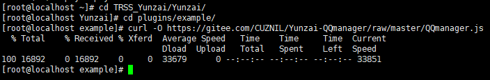
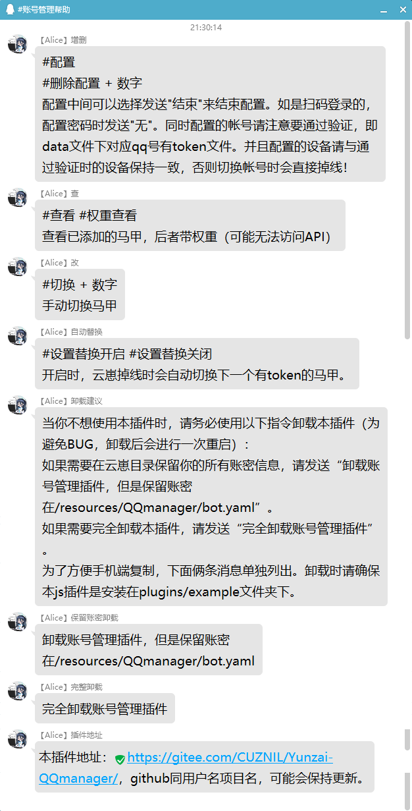

# 云崽Bot账号管理插件(js插件)

### 介绍
[账号管理插件](https://gitee.com/zhxhx/Yunzai-Bot-js/)改写自[BeterKing](https://gitee.com/zhxhx)。

该插件适用于[Yunzai-Bot v3](https://gitee.com/yoimiya-kokomi/Yunzai-Bot)

目前适配了使用[icqq协议的云崽](https://gitee.com/yoimiya-kokomi/Yunzai-Bot)，建议所有人尽早换源。不会换可以看我的[云崽安装教程](https://gitee.com/CUZNIL/Yunzai-install/)。


### 安装教程

 **目前已将安装过程整合到js插件内，直接安装js插件即可。** 

请确保你已经正确搭载了[云崽Bot v3](https://gitee.com/yoimiya-kokomi/Yunzai-Bot)。


将[`QQmanager.js`](https://gitee.com/CUZNIL/Yunzai-QQmanager/blob/master/QQmanager.js)文件放入`Yunzai-Bot/plugins/example/`文件夹下。

<details><summary>不知道怎么放？</summary>

首先进入云崽根目录。

然后输入以下指令：

进入js插件目录
```
cd plugins/example/
```
在此处下载本js插件
```
curl -O https://gitee.com/CUZNIL/Yunzai-QQmanager/raw/master/QQmanager.js
```
如图是参考的安装过程，如遇`xxx not found`报错请自己百度怎么处理。


———————————分割线———————————

</details>


### 使用说明

 **发送`#账号管理帮助`即可获取帮助信息。** 



以下是具体使用例:

如果图片没能正确加载请[点击此处](https://gitee.com/CUZNIL/Yunzai-QQmanager/blob/master/doc-use/%E6%BC%94%E7%A4%BA%E7%94%A8%E8%81%8A%E5%A4%A9%E8%AE%B0%E5%BD%95.txt)
#### 配置新账号

#### 查看已配置账号

#### 删除账号

#### 主动切换账号


#### 自动替换账号

### 我到底改了啥？


左侧行数：
- 70-73：如果没有正确安装插件，会报错提示搭建者去正确安装
- 77：提示搭建者使用`#查看`来确认目前配置的账号
- 84：提示搭建者使用`#重启`代替原地tp
- 87-88：当账号没有token时警告搭建者强行切换可能出错，并引导强制切换指令
- 103,105：优化`#查看`指令下的显示，现在会提示有无token以及常用指令


右侧行数：
- 33：优化处理逻辑，保证仅当查找到有token账号时切换账号
- 37-46：注释

 **目前已将安装过程整合到js插件内，直接安装js插件即可** 


### 遇到问题/需要联系我/需要使用Bot

群号 **638077675** 

答案  **火花骑士** 

[](http://jq.qq.com/?_wv=1027&k=tqiOtCVc)